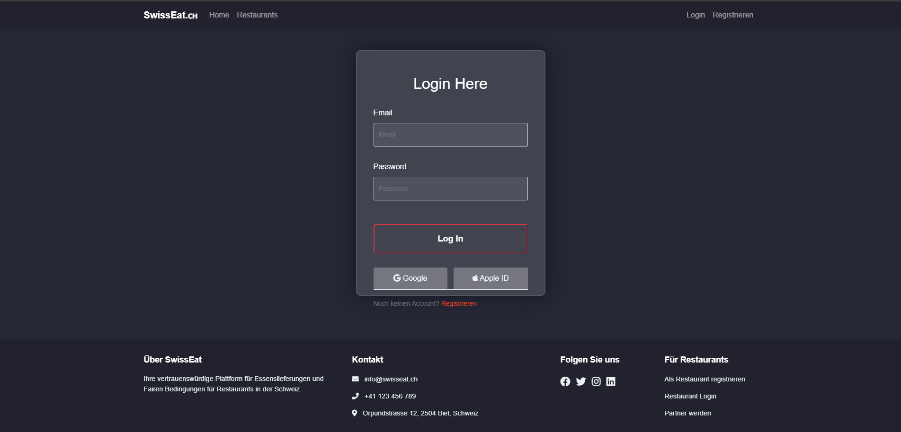
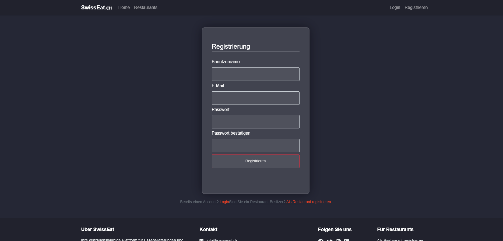

# SwissEat - Modern Food Delivery Platform

SwissEat is a sleek and modern food delivery platform built with Flask, designed to connect hungry customers with local restaurants in Switzerland. The platform features a dark mode UI and provides an intuitive experience for both customers and restaurant owners.

# ⚠️ Work in Progress

This project is under active development and not production-ready yet. (Project in German)





## Features

### For Customers

- 🔍 Browse restaurants by cuisine type
- 🛒 Easy ordering process with cart functionality
- 💳 Multiple payment options (Cash, TWINT, PayPal)
- 📍 Save delivery addresses
- 📱 Modern and responsive dark mode UI

### For Restaurant Owners

- 📊 Comprehensive dashboard with real-time statistics
- 🍽️ Menu management system
- 📦 Order tracking and management
- 💼 Business analytics
- 🔄 Toggle restaurant active status

### For Site Administrators

- 📊 MySql and PhpMyAdmin for better Database management
- ⚠️ Admin Dashboard and Backend with roles and access levels planned

## Technology Stack

- **Backend**: Python Flask
- **Database**: MySQL PyMySQL and PhpMyAdmin (included) (or SQLite with SQLAlchemy ORM)
- **Frontend**: HTML5, CSS3, JavaScript
- **Authentication**: Flask-Login
- **Forms**: Flask-WTF
- **UI Framework**: Bootstrap 5
- **Icons**: Font Awesome

## Installation (Experts)

1. Clone the repository:

```bash
git clone https://github.com/FunlightStudios/Food-Delivery-Platform.git
cd Food-Delivery-Platform
```

2. Create a virtual environment:

```bash
python -m venv venv
source venv/bin/activate  # On Windows: venv\Scripts\activate
```

3. Install dependencies:

```bash
pip install -r requirements.txt
```

4. Download and install php from:

(Extract the zip file to `c:\php`)

```bash
https://www.php.net/downloads.php
```


5. Download and install MySQL from:

```bash
https://downloads.mysql.com/archives/installer/
```


6. Edit the php.ini file:

Open the php.ini file and decomment or add the following lines:

```bash
extension=mysqli
extension=mbstring
extension=openssl

(optional)
extension=gd
extension=curl
extension=zip
```


7. Edit the config.inc.php file(PhpMyAdmin) if needed:

If you Choosed a diffrent MySql Password you need to change it in the PhpMyAdmin config file

`Food-Delivery-Platform\swisseat\templates\backend\phpmyadmin\config.inc.php`


8. Edit the Config.py file:

If you Choosed a diffrent MySql Password you need to change it in the Config.py file

`Food-Delivery-Platform\swisseat\config.py`


9. Run the application:

```bash
python run.py
```

or

```bash
flask run
```


10. Open your browser and Test:

The application will be available at `http://localhost:80`

You can change the Host, Port and Debug Mode in `run.py`


## Installation (Step by Step)

View `step-by-step-installation.md` (Comming Soon)


## Demo Accounts

You can log in with the following credentials

### User Demo

- Username: `user@example.com`
- Password: `password`

### Restaurant Owner Demo

- Username: `owner@example.com`
- Password: `password`

- Username: `owner1@example.com`
- Password: `password`

- Username: `owner2@example.com`
- Password: `password`

## Project Structure

```
SwissEat/
├── swisseat/
│   ├── __init__.py
│   ├── config.py
│   ├── models.py
│   ├── static/
│   │   ├── css/
│   │   └── img/
│   ├── templates/
│   └── routes/
├── migrations/
├── instance/
├── requirements.txt
└── README.md
```

## Contributing

1. Fork the repository
2. Create your feature branch (`git checkout -b feature/AmazingFeature`)
3. Commit your changes (`git commit -m 'Add some AmazingFeature'`)
4. Push to the branch (`git push origin feature/AmazingFeature`)
5. Open a Pull Request

## License

This project is licensed under the MIT License - see the LICENSE file for details.

## Acknowledgments

- Flask documentation and community
- Bootstrap team for the amazing UI framework
- Font Awesome for the beautiful icons
