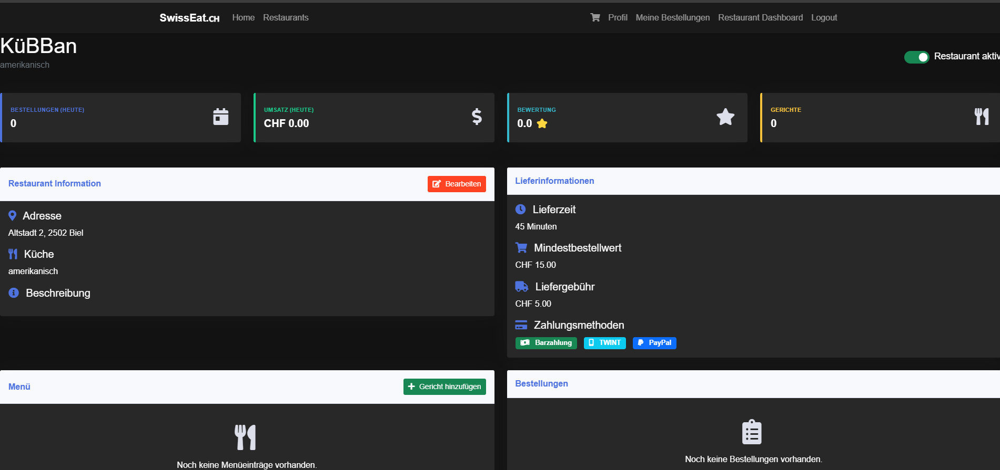
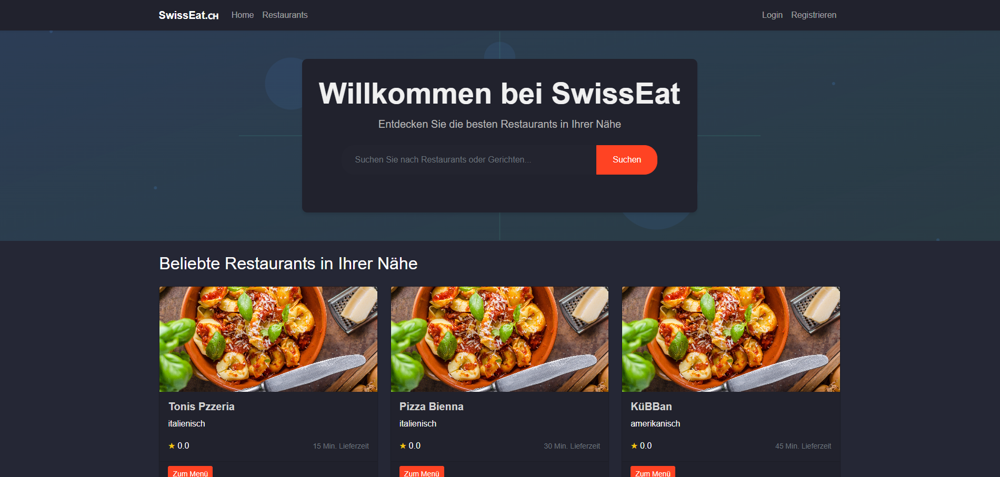

# SwissEat - Modern Food Delivery Platform

SwissEat is a sleek and modern food delivery platform built with Flask, designed to connect hungry customers with local restaurants in Switzerland. The platform features a dark mode UI and provides an intuitive experience for both customers and restaurant owners.

# ⚠️ Work in Progress
This project is under active development and not production-ready yet. (Project in German)




## Features

### For Customers
- 🔍 Browse restaurants by cuisine type
- 🛒 Easy ordering process with cart functionality
- 💳 Multiple payment options (Cash, TWINT, PayPal)
- 📍 Save delivery addresses
- 📱 Modern and responsive dark mode UI

### For Restaurant Owners
- 📊 Comprehensive dashboard with real-time statistics
- 🍽️ Menu management system
- 📦 Order tracking and management
- 💼 Business analytics
- 🔄 Toggle restaurant active status

## Technology Stack

- **Backend**: Python Flask
- **Database**: SQLite with SQLAlchemy ORM
- **Frontend**: HTML5, CSS3, JavaScript
- **Authentication**: Flask-Login
- **Forms**: Flask-WTF
- **UI Framework**: Bootstrap 5
- **Icons**: Font Awesome

## Installation

1. Clone the repository:
```bash
git clone https://github.com/yourusername/SwissEat.git
cd SwissEat
```

2. Create a virtual environment:
```bash
python -m venv venv
source venv/bin/activate  # On Windows: venv\Scripts\activate
```

3. Install dependencies:
```bash
pip install -r requirements.txt
```

4. Initialize the database:
```bash
flask db upgrade
```

5. Run the application:
```bash
flask run
```

The application will be available at `http://localhost:5000`

## Demo Accounts
You can log in with the following credentials

# User Demo
- Username: `user@example.com`
- Password: `password` 

# Restaurant Owner Demo
- Username: `owner@example.com`
- Password: `password` 

- Username: `owner1@example.com`
- Password: `password`

- Username: `owner2@example.com`
- Password: `password`

## Project Structure

```
SwissEat/
├── swisseat/
│   ├── __init__.py
│   ├── config.py
│   ├── models.py
│   ├── static/
│   │   ├── css/
│   │   └── img/
│   ├── templates/
│   └── routes/
├── migrations/
├── instance/
├── requirements.txt
└── README.md
```

## Contributing

1. Fork the repository
2. Create your feature branch (`git checkout -b feature/AmazingFeature`)
3. Commit your changes (`git commit -m 'Add some AmazingFeature'`)
4. Push to the branch (`git push origin feature/AmazingFeature`)
5. Open a Pull Request

## License

This project is licensed under the MIT License - see the LICENSE file for details.

## Acknowledgments

- Flask documentation and community
- Bootstrap team for the amazing UI framework
- Font Awesome for the beautiful icons
